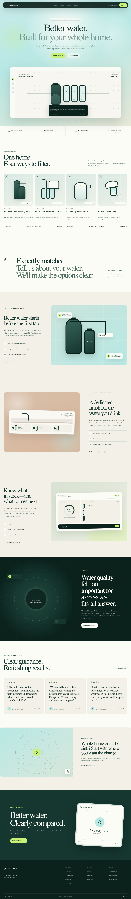
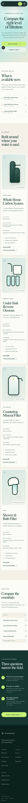
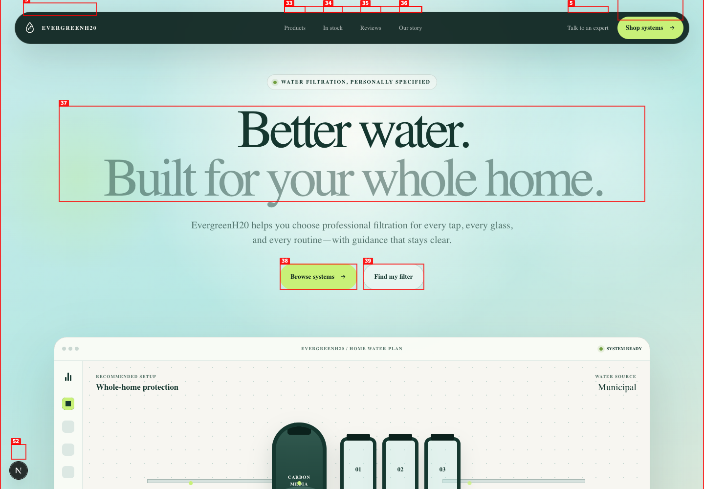
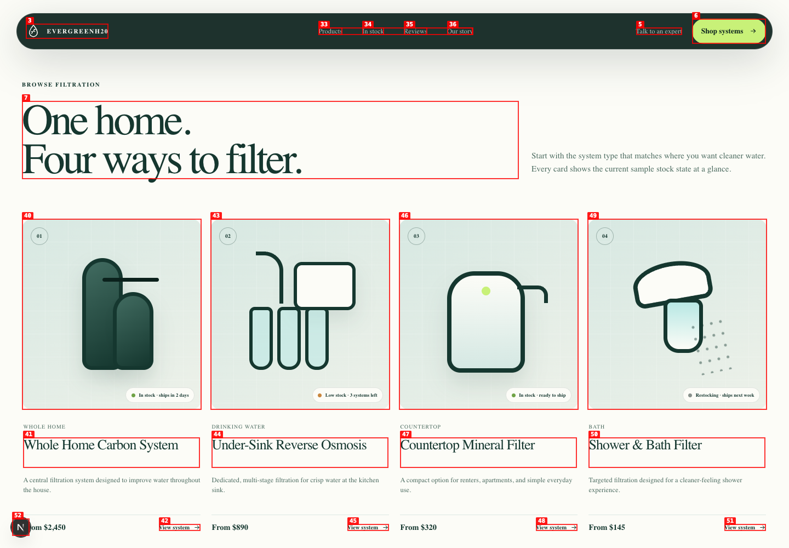
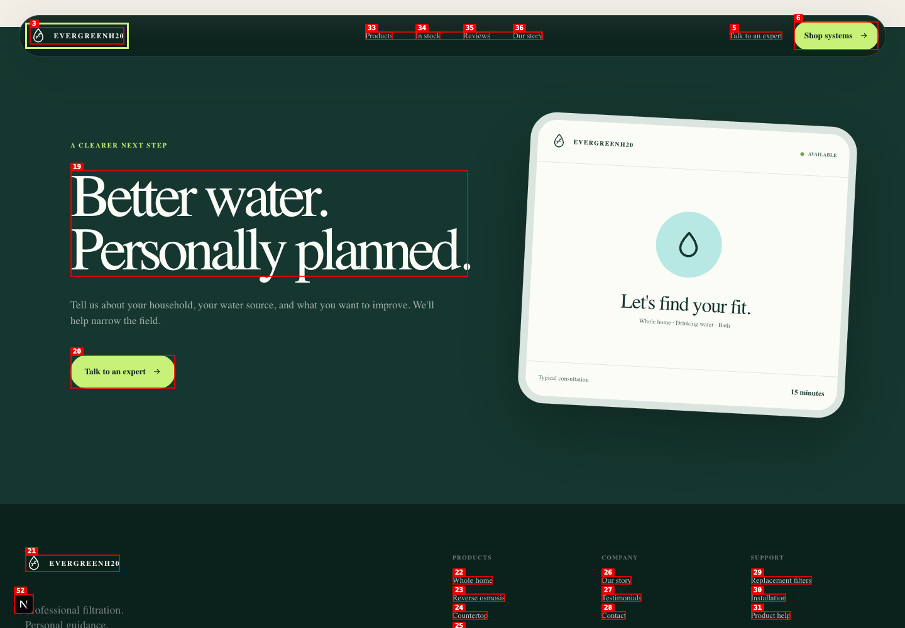
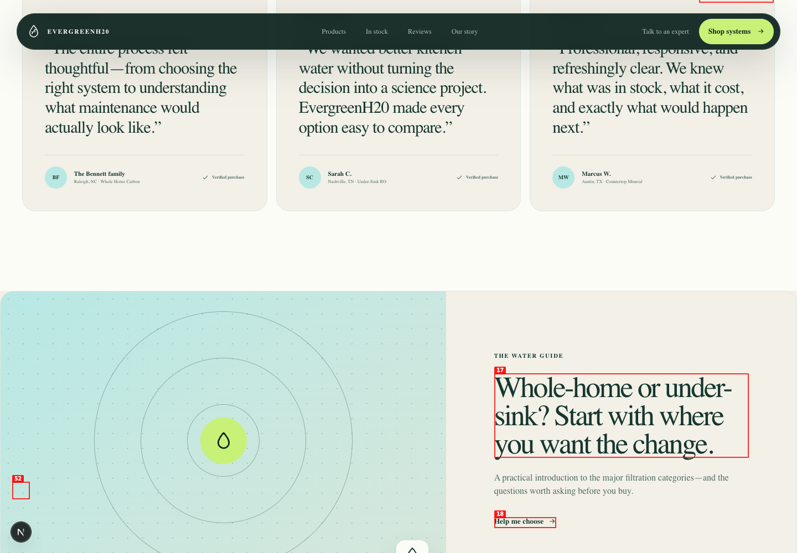
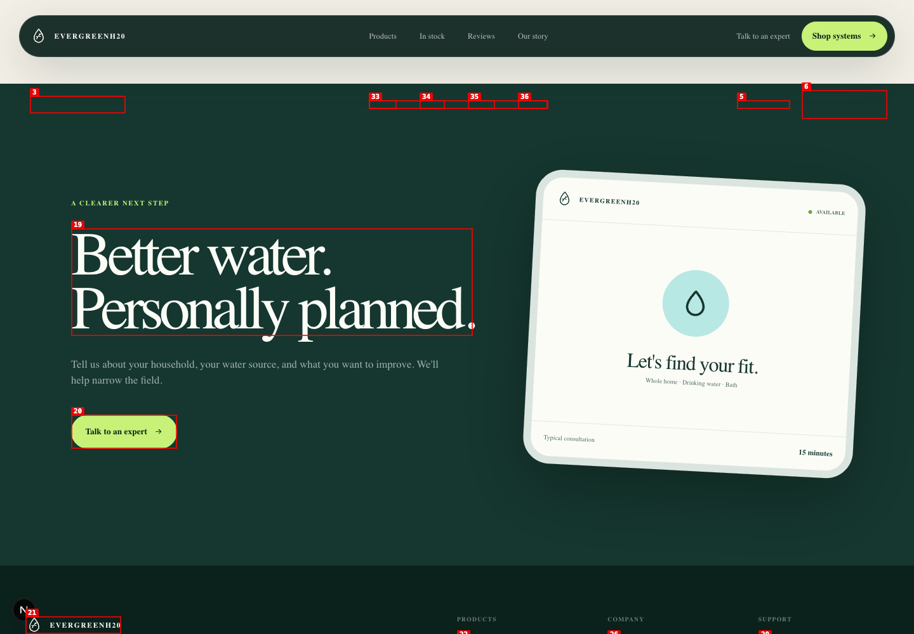
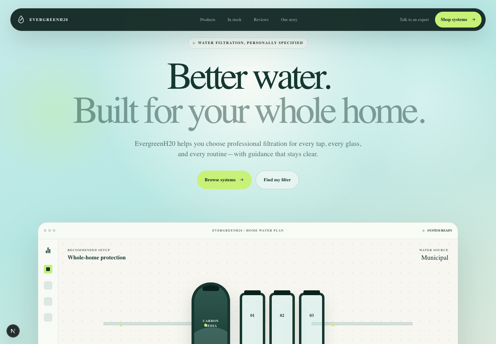
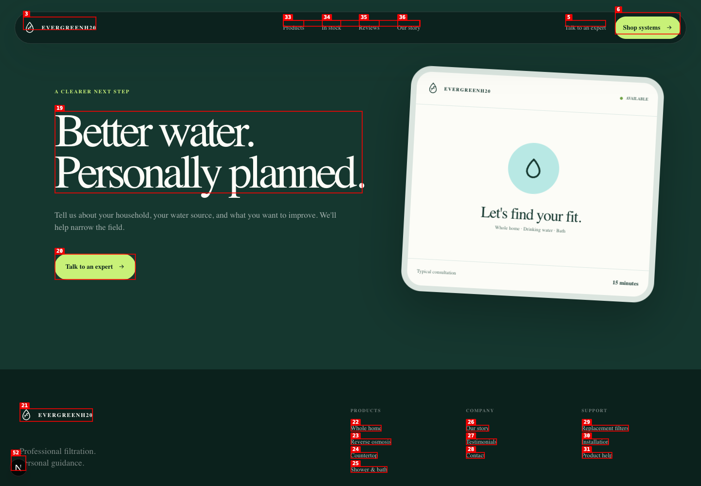

# Dogfood Report: EvergreenH20

| Field | Value |
|---|---|
| **Date** | 2026-07-22 |
| **App URL** | http://127.0.0.1:3000 (development), http://127.0.0.1:3001 (production verification) |
| **Session** | evergreen-adversarial |
| **Scope** | Full public storefront, desktop and mobile |

## Summary

The initial adversarial pass found six medium-severity issues. All six were remediated and re-tested; no known issue from this pass remains open.

| Severity | Baseline | Open after remediation |
|---|---:|---:|
| Critical | 0 | 0 |
| High | 0 | 0 |
| Medium | 6 | 0 |
| Low | 0 | 0 |
| **Total** | **6** | **0** |

## Remediation Results

| Issue | Status | Verified resolution |
|---|---|---|
| ISSUE-001 | Fixed | Removed the non-routable email conversion path; primary actions now lead to the product comparison and buying guide. |
| ISSUE-002 | Fixed | Added a dedicated catalog with anchored detail sections, ownership information, prices, highlights, and a comparison table. |
| ISSUE-003 | Fixed | Removed the fabricated aggregate score and verified-purchase claims; samples are explicitly labeled as preview content to replace before launch. |
| ISSUE-004 | Fixed | Added linked Privacy, Terms, and Accessibility routes with plain-language prototype notices. |
| ISSUE-005 | Fixed | Added a visible-on-focus skip link, focusable main landmarks, strong focus styles, and fixed-header anchor offsets. |
| ISSUE-006 | Fixed | “Products” and “In stock” now have distinct destinations; inventory is a dedicated, explicitly disclosed preview section. |

## Production Verification

| Page | Performance | Accessibility | Best practices | SEO | Agentic browsing |
|---|---:|---:|---:|---:|---:|
| Home | 98 | 100 | 100 | 100 | 100 |
| Products | 99 | 100 | 100 | 100 | 100 |

- Lighthouse reported no failing binary audits on either production page.
- Homepage metrics: FCP 0.9 s, LCP 2.3 s, CLS 0, TBT 10 ms.
- Product metrics: FCP 0.8 s, LCP 2.1 s, CLS 0, TBT 70 ms.
- Browser regression covered 1440 px desktop and 320 px mobile layouts, mobile menu behavior, skip-link focus transfer, anchored navigation, contained comparison-table scrolling, console errors, and all public route responses.
- `npm run lint`, `npm run build`, and `npm audit --omit=dev` pass; the audit reports zero vulnerabilities.

## Issues

### ISSUE-001: Primary consultation CTA uses a non-routable email address

| Field | Value |
|---|---|
| **Severity** | medium |
| **Category** | functional |
| **URL** | http://127.0.0.1:3000/#consultation |
| **Repro Video** | N/A |

**Description**

The strongest conversion action links to `hello@evergreenh20.example`. The `.example` top-level domain is reserved and cannot receive mail, so the core consultation workflow cannot complete. Reloading the page reproduces the same destination.

**Repro Steps**

1. Navigate to the consultation section.
2. Inspect the “Talk to an expert” destination.
3. Observe that the link targets a non-routable `.example` address.

---

### ISSUE-006: “In stock” navigation duplicates “Products”

| Field | Value |
|---|---|
| **Severity** | medium |
| **Category** | ux |
| **URL** | http://127.0.0.1:3000/ |
| **Repro Video** | N/A |

**Description**

“Products” and “In stock” are separate primary-navigation choices but both target `#products`. The inventory choice provides no filtered list, dedicated anchor, or inventory summary, so it creates an expectation the destination does not meet.

**Repro Steps**

1. Inspect the primary navigation.
2. Select “Products,” then “In stock.”
3. Observe that both navigate to the identical `#products` destination.

---

### ISSUE-005: Keyboard navigation has no “Skip to content” path

| Field | Value |
|---|---|
| **Severity** | medium |
| **Category** | accessibility |
| **URL** | http://127.0.0.1:3000/ |
| **Repro Video** | N/A |

**Description**

The first Tab stop is the brand link inside the fixed header. There is no skip link, so keyboard and assistive-technology users must traverse the complete navigation before reaching page content. In-page anchor targets also lack a fixed-header scroll offset.

**Repro Steps**

1. Reload the page and press Tab once.
2. Observe that focus moves directly to “EvergreenH20 home.”
3. Observe that no “Skip to content” control is available before the header.

---

### ISSUE-004: Footer presents legal and accessibility labels without destinations

| Field | Value |
|---|---|
| **Severity** | medium |
| **Category** | functional |
| **URL** | http://127.0.0.1:3000/#consultation |
| **Repro Video** | N/A |

**Description**

“Privacy,” “Terms,” and “Accessibility” visually resemble footer navigation, but they are plain text. The footer-bottom region contains only one link—“Back to top.” A professional storefront needs navigable policy and accessibility information.

**Repro Steps**

1. Navigate to the page footer.
2. Attempt to select Privacy, Terms, or Accessibility.
3. Observe that none is an interactive destination.

---

### ISSUE-003: Placeholder testimonials are presented as verified purchases

| Field | Value |
|---|---|
| **Severity** | medium |
| **Category** | content |
| **URL** | http://127.0.0.1:3000/#reviews |
| **Repro Video** | N/A |

**Description**

The section discloses “Sample review layout,” but still displays a perfect `5.0` rating and marks all three invented profiles as “Verified purchase.” The mixed signals weaken trust and could become deceptive if the page were launched before real testimonials were supplied.

**Repro Steps**

1. Navigate to the testimonials section.
2. Observe “Sample review layout” beside a `5.0` rating.
3. Observe that every sample profile is simultaneously labeled “Verified purchase.”

---

### ISSUE-002: Product “View system” links do not provide product details

| Field | Value |
|---|---|
| **Severity** | medium |
| **Category** | functional |
| **URL** | http://127.0.0.1:3000/#products |
| **Repro Video** | Unavailable: local ffmpeg encoder failed; step screenshots captured |

**Description**

Every product promises a “View system” action, but selecting it skips directly to the generic consultation section. There is no specification, comparison, maintenance, suitability, or product-detail view. The behavior reproduced after a full reload.

**Repro Steps**

1. Navigate to the product collection and select “View system” on the first card.

   

2. Observe that the destination is the generic consultation CTA rather than product information.

   

---
